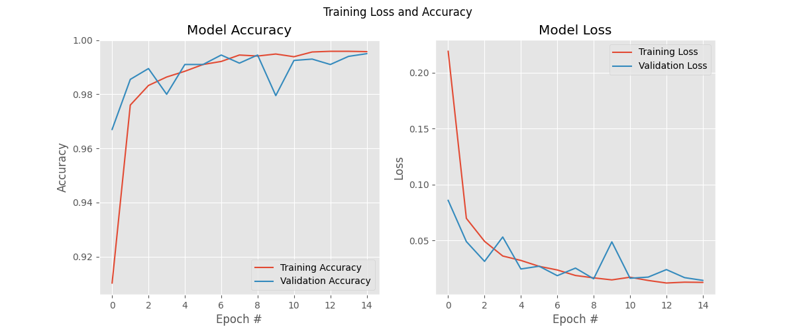

# Real-Time Face Mask Detection System using Deep Learning

This is a Python project that uses deep learning (CNN) and computer vision (OpenCV) to detect whether a person in a live video feed is wearing a face mask.

The system finds faces in the frame, runs a custom-trained Keras/TensorFlow model on each face, and draws a green bounding box for "Mask" or a red one for "No Mask," along with a confidence score.


## 🚀 Features

* **Real-time detection** from a live webcam feed.
* **Deep Learning Model:** A Convolutional Neural Network (CNN) built with TensorFlow and Keras.
* **High Accuracy:** Trained on a public dataset of over 12,000 images.
* **Clear Visual Feedback:**
    * **Green Box:** Mask detected
    * **Red Box:** No Mask detected
    * **Confidence Score:** Shows the model's certainty (e.g., "Mask - 98.75%")

## 🛠️ Technology Stack

* **Python 3.8+**
* **TensorFlow / Keras** (For building and training the CNN)
* **OpenCV** (For video capture, face detection, and drawing)
* **NumPy** (For numerical operations and image preprocessing)
* **Matplotlib** (For plotting the training accuracy and loss)
* **scikit-learn** (For splitting data into training and testing sets)

## 📦 Setup & Installation

1.  **Clone the repository:**
    ```bash
    git clone https://github.com/Sneha16-coder/Face-Mask-Detector.git
    cd YOUR_REPO_NAME
    ```

2.  **Install the required libraries:**
    ```bash
    pip install tensorflow opencv-python numpy matplotlib scikit-learn
    ```

3.  **Download the Face Finder:**
    * This project uses OpenCV's pre-trained Haarcascade for face detection.
    * Download the file `haarcascade_frontalface_default.xml` from [this link](https://raw.githubusercontent.com/opencv/opencv/master/data/haarcascades/haarcascade_frontalface_default.xml) and place it in the project's root folder.

4.  **Download the Dataset (for training your own model):**
    * The model was trained on the "Face Mask 12k Images Dataset" from Kaggle.
    * You can download it here: [Kaggle Dataset Link](https://www.kaggle.com/datasets/ashishjangra27/face-mask-12k-images-dataset)
    * Unzip it and place the `Train` folder in the project directory as specified in `1_prepare_data.py`.
  
5. **Download the Trained Model from below links**
   * face_mask_detector.keras:   https://drive.google.com/file/d/1X-JYrF30Bp6fMQirtestVzZgVTEzrp9WUiUv/view?usp=drivesdk
   * test_data.npy: https://drive.google.com/file/d/1_zC4IZbbCKMnhvRRIOOVR0OaZxb6V66d/view?usp=drivesdk
   * test_labels.npy: https://drive.google.com/file/d/1Z2dlGl2FKGa0mQwQc9MlV7_awCDWbEzd/view?usp=drivesdk
   * train_labels.npy: https://drive.google.com/file/d/1fbL1DXm8dCArAIYO6E0UMHJJhprd9V1Z/view?usp=drivesdk
   * train_data.npy: https://drive.google.com/file/d/1-uqw94FWRa0J0d59OwAiwI6bezbZDojR/view?usp=drive_link

6. Run the Project:
   python 3_run_webcam.py
  
## Project Structure

    📂 MASK_DETECTOR
 ┣ 📂 Face Mask Dataset
 ┃ ┣ 📂 Train
 ┃ ┣ 📂 Test
 ┃ ┗ 📂 Validation
 ┣ 📜 1_prepare_data.py
 ┣ 📜 2_train_model.py
 ┣ 📜 3_run_webcam.py
 ┣ 📜 app.py
 ┣ 📜 face_mask_detector.keras
 ┣ 📜 haarcascade_frontalface_default.xml
 ┣ 📜 .gitignore
 ┣ 📜 README.md
 ┣ 📜 test_data.npy
 ┣ 📜 test_labels.npy
 ┣ 📜 train_data.npy
 ┗ 📜 train_labels.npy

## 🏃 Explaination of this project

The project is broken into three main scripts, which must be run in order:

1.  **`1_prepare_data.py`**
    * This script loads all the raw images from the dataset, resizes them, normalizes them, and saves them as four `.npy` files for fast loading.
    * ```bash
      python 1_prepare_data.py
      ```

2.  **`2_train_model.py`**
    * This script loads the `.npy` files, builds the CNN model, trains it for 15 epochs, and saves the final trained "brain" as `face_mask_detector.keras`.
    * ```bash
      python 2_train_model.py
      ```

3.  **`3_run_webcam.py`**
    * This is the final application! It loads your `face_mask_detector.keras` model and the Haarcascade file to run the live detection from your webcam.
    * ```bash
      python 3_run_webcam.py
      ```
    * Press **'q'** to quit the video stream.
  
## Results

The model was trained for 15 epochs on a dataset containing images of people with and without face masks.
Below is the training performance summary:

✅ Model Accuracy: 99.5%
📉 Model Loss: 0.02


Both training and validation accuracy curves show a steady increase, while the loss values continuously decrease — indicating that the model learned effectively and achieved excellent generalization.
The close alignment between training and validation metrics confirms that the model is not overfitting.

The model performs reliably on unseen data and can accurately detect masked and unmasked faces in real-time webcam input.

### 📊 Training Accuracy and Loss




## Conclusion / Future Scope:

 This model can be deployed in real-world systems like CCTV surveillance to ensure public safety.
 In future, it can be enhanced to detect social distancing and emotion recognition.


  
